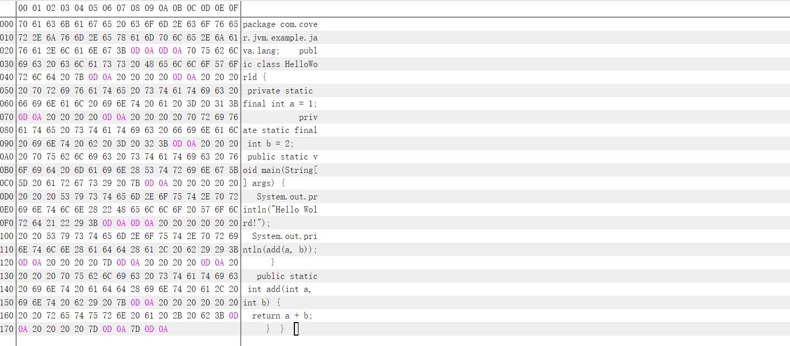
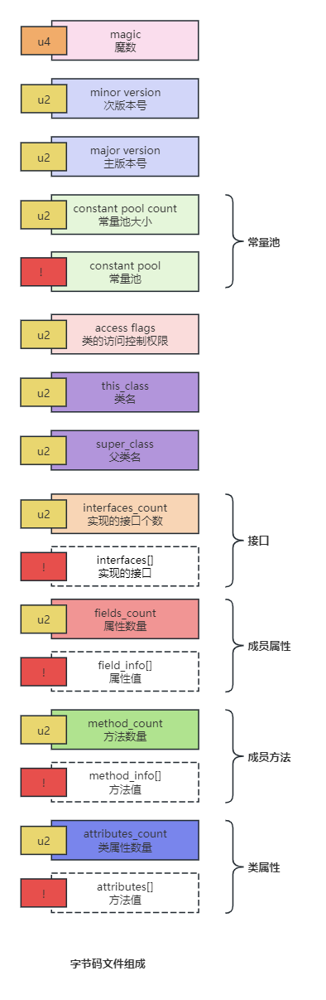
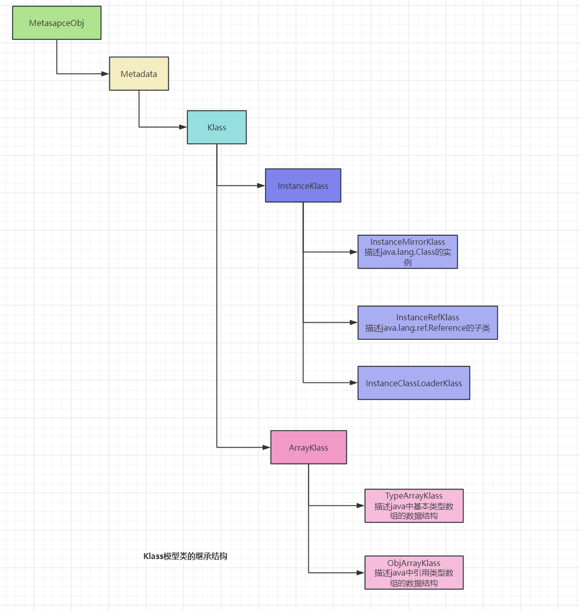
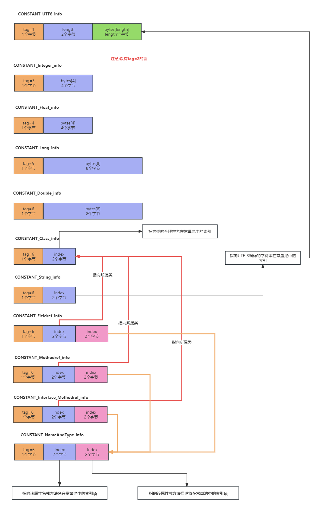
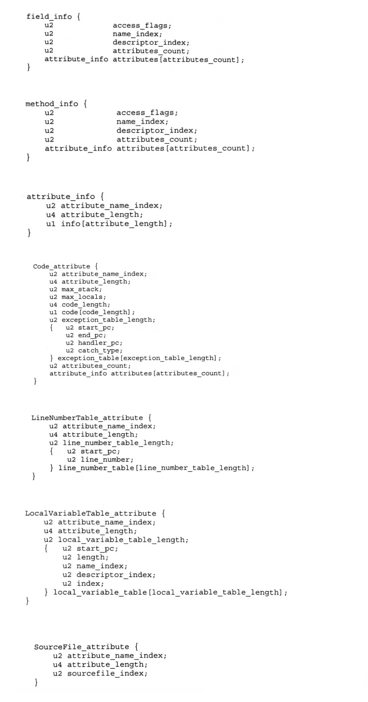
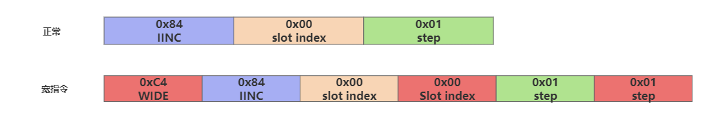
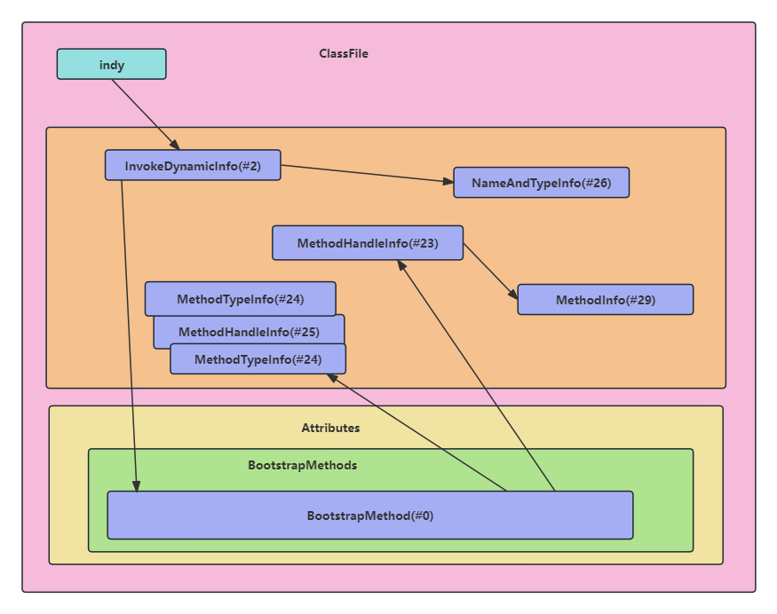
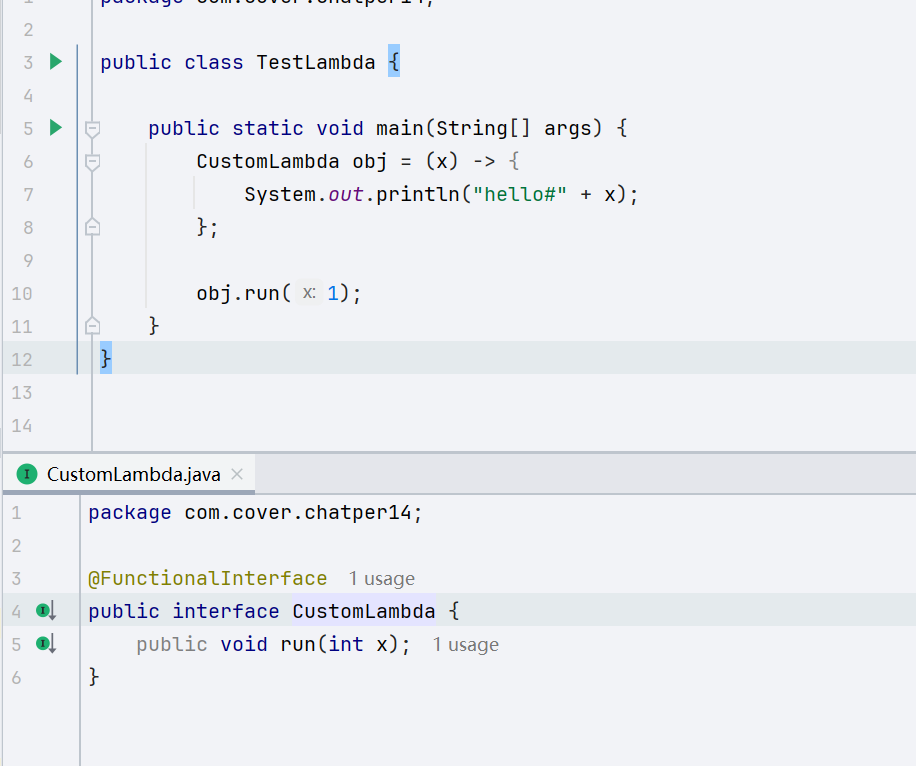

# XVM(自己手写的Java VM)
手写JVM,为了目录比较清晰，该项目的目录结构是根据HotSpot的目录划分的，也是为了加深我们对HotSpot的理解
## 参考HotSpot版本1.8
源码下载链接: https://pan.baidu.com/s/158pDFPa2WYEVnJZ6qclxUw 提取码: 4p6f
## 主要模块
HotSpot源码结构相当庞大,在该项目中并没有完完全全地实现其中每个功能,一方面由于语言限制,Java不像C++那样可以直接操作内存,其实也可以实现，不过实现起来需要更多的
模块结构去支撑这一体系,难度可想而知。
### 1.字节码文件解析器
#### class文件组成
```java
public class HelloWorld {
    
    private static final int a = 1;
    
    private static final int b = 2;
    public static void main(String[] args) {
        System.out.println("Hello Wolrd!");

        System.out.println(add(a, b));
    }
    
    public static int add(int a, int b) {
        return a + b;
    }
}
```
以HelloWorld代码为例,经过javac编译之后生成HelloWorld.class,那么我们怎么解析呢？

其实在class文件中,虚拟机是有自己的规范的,按照一定的顺序来存放的,顺序如下:


+ 1.魔数 4B(CAFE BABE)
+ 2.次版本号 2B
+ 3.主版本号 2B
+ 4.常量池大小 2B
+ 5.类的访问权限 2B
+ 6.类名 2B
+ 7.父类名 2B
+ 8.实现的接口个数2B、实现的接口
+ 9.属性数量2B、属性
+ 10.方法数量2B、方法

在HotSpot源码中，class字节码文件解析的过程在/hotspot/src/share/vm/classfile/classFileParser.cpp中的parseClassFile方法当中
#### Java类在C++中的存储形式
根据上面的字节码组成结构,我们还需要知道一个Java对象在C++中的存在形式有哪些，进而在手写JVM的时候数据属性放在哪个对象之下。
在HotSpot的世界中，一个Java类对应着一个Klass模型的实例，其中
+ InstanceKlass是Java普通类的存在的C++形式，这个类是存储在方法区当中
+ InstanceMirrorKlass是Java类的Class对象，比如下面代码
```java
Class helloWorld = HelloWorld.class;
```
InstanceMirrorKlass是存储在堆区中的C++实例，学名叫做镜相类
上面的分类是针对于非数组类型，那么对于数组类型来说，
byte、boolean、char、short、int、float、long、double -> TypeArrayKlass
引用类型 -> ObjArrayKlass




#### 常量池的解析
常量池项的数据类型


虚拟机规范当中的数据结构


#### i++的实现底层

```java
int i = 1;
i++;
```
操作步骤:
1.第一个操作数，拿到slot的index
2.第二个操作数，增加或减少的不长
3.完成运算
4.写回局部变量表

这个单独拿出来说，是因为觉得JVM的设计者的构思非常的巧妙，它的字节码对应的是iinc,这个字节码本身就是自增的意思，为什么还需要解释成iinc 1 by 1呢？
巧妙之处在于，如果想要实现i--这样的自减命令，或者i +=2时，这条iinc也可以使用，如果换作正常思维肯定是i++用一个字节码指令来实现，i--用一个字节码来实现，
一方面JVM的字节码指令只占1B,只能有255条指令，现如今已经使用了203条了.

通过上图我们还可以看到,slot的index在操作时只分配了一个字节，那也就是意味着说，局部变量表不能超过255个，不然就得拆成多个字节码指令来做，但是这样会影响JVM的执行效率。
那如果超过之后，JVM会怎么做呢？
在操作系统中，也存在着这样的问题，OS是对指令做了扩展，封装了一层二级指令，现在已经到了三级指令。
在这里我们也可以预测出，假如JVM以后要支持某种新特性的话，扩展字节码指令时，于是就出现了扩展指令.

### 2.数据类型的处理
我们知道在栈帧中小于等于4B的数据类型,是用一个插槽Slot来存储局部变量的,对于像Long、Double这样8B的数据类型，JVM是用两个Slot来表示，那么在字节码中,是被拆开了的。
而在我们当前的JVM中，则是合并在一起存储/读取的，只要不超过2的32次方-1这个数值,那么这样操作是没问题的。
注意:Linux 64位操作系统在操作原生栈的时候，CPU总是是以Word Size位单位(8B)字节从内存中进行读取/存储的，但是呢,JVM为了兼容32位机器,一直采用4B一个Slot
以后的话，这也是一个遗留问题，以后可能会出先最低版本兼容

### 3.方法的栈帧处理、流程控制
栈帧方面是用Java的Stack类型支持的，没有什么特殊处理的地方
### 4.支持lambda表达式
#### 1.实现原理

+ 首先JVM会拿到常量池中的JVM_CONSTANT_InvokeDynamic信息，创建出Lambda的实现对象
+ 接着从常量池JVM_COSNTANT_InvokeDynamic中拿到BootstrapMethods的索引，即目前调用的是第几个BootstrapMethod
+ BootstrapMethod结构中的Bootstrap方法，对应的常量池项是MethodHandle，JVM就是通过LambdaMetafactory.metafactory创建出来CallSite,进而创建出Lambda表达式对应的对象的。
BootstrapMethod结构中的其他信息，都是一些辅助信息，是调用metafactory方法需要传的参数
```java
<java/lang/invoke/LambdaMetafactory.metafactory : (Ljava/lang/invoke/MethodHandles$Lookup;Ljava/lang/String;Ljava/lang/invoke/MethodType;Ljava/lang/invoke/MethodType;Ljava/lang/invoke/MethodHandle;Ljava/lang/invoke/MethodType;)Ljava/lang/invoke/CallSite;>
```
+ JVM也是通过执行LambdaMetafactory.metafactory完成Lambda表达式对应的函数式接口与具体实现中的代码的关联。背后的实现原理就是通过字节码
+ 默认的会在内存中生成一个新的类，并返回这个类的实例，所以可以这样调用方法
```java
obj.run(1);
```

#### 2.Lambda表达式的实现主要依托三个东西
+ 1.匿名内部类
+ 2.invokedynamic
+ 3.MethodHandle
#### 3.字节码角度看Lambda表达式
+ 1.常量池:JVM_Constant_InvokeDynamic_info、JVM_CONSTANT_MethodHandle(两个)、JVM_CONSTANT_MethodType
+ 2.类属性:BootstrapMethods
#### 4.如何自实现呢？
我们最终的目的是想要生成一个MethodHandles.Lookup,一个类只会有一个Lookup
```java
// 没有这样的API实现，我们需要用MethodHandle + 反射来实现
MethodHandles.lookup(TestLambda.class);
```

具体的实现请看com.cover.jvm.hotspot.src.share.vm.interpreter.LambdaEngine.createObject